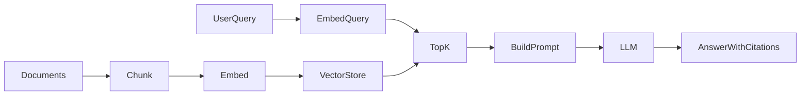

# LLM + RAG Study — Phase-by-Phase Build Guide (Node.js)

Build this yourself, one phase at a time. Each phase has a clear goal, folder layout, and a "done when" checkpoint.

**Stack:** Node.js 18+, `openai` SDK, `dotenv`, plain JSON vector store (no framework).

---

## Overview

| Phase | Project | Time | Prerequisite |
|-------|---------|------|--------------|
| 0 | Environment setup | ~30 min | — |
| 1 | Minimal chat client | ~half day | Phase 0 |
| 2 | From-scratch RAG | ~1–2 days | Phase 1 |
| 3 | RAG evaluation | ~1 day | Phase 2 |
| 4 | Tool-calling agent | ~1–2 days | Phase 2 |
| 5 | Local-only stack (optional) | ~1 day | Phase 2 |
| 6 | Multi-turn Memory Agent | ~half day | Phase 4 |
| 7 | Real Vector Database | ~1 day | Phase 2 |
| 8 | Document Parsing | ~1 day | Phase 2 |
| 9 | Advanced Chunking | ~1–2 days | Phase 2 |
| 10 | Reranking | ~1 day | Phase 2 |
| 11 | Structured Output | ~1 day | Phase 4 |
| 12 | Hybrid Search | ~1–2 days | Phase 7 |
| 13 | Agentic RAG | ~2 days | Phase 11 |
| 14 | Web Interface | ~2 days | Phase 13 |
| 15 | Deployment | ~1 day | Phase 14 |


---

## Phase 0 — Environment Setup

**Goal:** One working way to call an LLM.

**Pick one backend:**

- **Ollama** (local, free): install Ollama, pull `llama3.2` and `nomic-embed-text`
- **OpenAI** (cloud): get an API key

**Create a minimal project:**

```
llm-rag-study/
├── .env                 # API keys / model names
├── .env.example
├── package.json
├── src/
│   ├── config.js        # read env vars, pick OpenAI vs Ollama
│   └── client.js        # thin OpenAI SDK wrapper
└── sample_docs/         # (Phase 2)
```

**Initialize:**

```bash
mkdir llm-rag-study && cd llm-rag-study
npm init -y
npm install openai dotenv
```

**`.env.example`:**

```env
# OpenAI (cloud)
OPENAI_API_KEY=sk-...
OPENAI_CHAT_MODEL=gpt-4o-mini
OPENAI_EMBED_MODEL=text-embedding-3-small

# Ollama (local — used when OPENAI_API_KEY is unset)
OLLAMA_BASE_URL=http://localhost:11434/v1
OLLAMA_CHAT_MODEL=llama3.2
OLLAMA_EMBED_MODEL=nomic-embed-text
```

**`src/config.js` sketch:**

```js
import "dotenv/config";

const hasOpenAI = process.env.OPENAI_API_KEY && !process.env.OPENAI_API_KEY.startsWith("sk-...");
export const useOllama = !hasOpenAI;
export const chatModel = useOllama ? process.env.OLLAMA_CHAT_MODEL : process.env.OPENAI_CHAT_MODEL;
export const embedModel = useOllama ? process.env.OLLAMA_EMBED_MODEL : process.env.OPENAI_EMBED_MODEL;
export const baseURL = useOllama ? process.env.OLLAMA_BASE_URL : undefined;
```

**`src/client.js` sketch:**

```js
import OpenAI from "openai";
import { baseURL } from "./config.js";

export function getClient() {
  return new OpenAI({
    baseURL,
    apiKey: process.env.OPENAI_API_KEY ?? "ollama",
  });
}
```

Add to `package.json`:

```json
{ "type": "module" }
```

**Done when:** A one-liner script calls the model and prints a response.

**Run:**

```bash
# Copy env and fill in your key (or leave unset for Ollama)
cp .env.example .env

# If using Ollama — start the daemon and pull models first
ollama serve   # if not already running
ollama pull llama3.2
ollama pull nomic-embed-text

# Smoke-test the client
npm run smoke
# or: node src/smoke-test.js
```

Expected: prints the backend name, model, and a short reply (e.g. `smoke ok`).

---

## Phase 1 — Minimal Chat Client

**Goal:** Understand how chat APIs actually work.

**Build:** `src/01-chat-client/chat.js` — a CLI loop (use `readline`).

**Features to implement (in order):**

1. **Single-turn call** — one user message → one assistant reply
2. **System prompt** — add a `system` message that sets behavior
3. **Multi-turn history** — keep a `messages[]` array; push user + assistant each turn
4. **Streaming** — iterate `for await (const chunk of stream)` and print deltas
5. **Temperature flag** — parse `--temperature 0.7` from `process.argv`

**Example streaming call:**

```js
import { getClient } from "../client.js";
import { chatModel } from "../config.js";

const client = getClient();
const stream = await client.chat.completions.create({
  model: chatModel,
  messages,
  temperature: 0.7,
  stream: true,
});

for await (const chunk of stream) {
  process.stdout.write(chunk.choices[0]?.delta?.content ?? "");
}
```

**Add npm script:**

```json
"scripts": {
  "chat": "node src/01-chat-client/chat.js"
}
```

**Run:**

```bash
# Interactive chat (Ctrl+C to exit)
npm run chat
# or: node src/01-chat-client/chat.js

# With temperature
npm run chat -- --temperature 0.7
# or: node src/01-chat-client/chat.js --temperature 0.7
```

Type a few messages, confirm replies stream token-by-token, and that history carries across turns.

**Concepts to study as you build:**

- Roles: `system`, `user`, `assistant`
- APIs are **stateless** — you resend full history every request
- Low temperature = more deterministic (good for facts later in RAG)

**Done when:** You can have a 5-turn conversation with streaming, and explain what each message role does.

**Stretch:** Sum `message.content.length` across turns to feel context growth.

---

## Phase 2 — From-Scratch RAG (Core)

**Goal:** Build the full retrieval pipeline by hand — no LangChain, no heavy frameworks.

**Target layout:**

```
src/
├── 02-rag/
│   ├── chunker.js       # split text into chunks
│   ├── vectorStore.js   # save/load embeddings + search
│   ├── ingest.js        # docs → chunks → embeddings → store
│   └── query.js         # question → retrieve → prompt → answer
sample_docs/             # 3–5 .md or .txt files you write
data/
└── vector_store.json    # generated
```

**No extra deps required** — use `fs/promises`, `path`, and a hand-rolled cosine similarity. Optional: `glob` for file discovery (`npm install glob`).

### Step 2a — Chunking (`chunker.js`)

```js
export function chunkText(text, { chunkSize = 500, overlap = 50 } = {}) {
  const chunks = [];
  let start = 0;
  while (start < text.length) {
    chunks.push(text.slice(start, start + chunkSize).trim());
    if (start + chunkSize >= text.length) break;
    start += chunkSize - overlap;
  }
  return chunks.filter(Boolean);
}
```

**Experiment:** try 200 vs 500 vs 1000 and notice what breaks later.

### Step 2b — Embeddings (`ingest.js`)

For each chunk:

1. Call embedding API (`text-embedding-3-small` or Ollama `nomic-embed-text`)
2. Store: `{ id, source, text, embedding: number[] }`

```js
const client = getClient();
const { data } = await client.embeddings.create({
  model: embedModel,
  input: texts, // batch an array of strings
});
const vectors = data.map((d) => d.embedding);
```

### Step 2c — Vector Store (`vectorStore.js`)

Start simple:

- `save()` → `fs.writeFile("data/vector_store.json", ...)`
- `load()` on startup if file exists
- `search(queryEmbedding, topK)` using cosine similarity:

```js
function cosineSimilarity(a, b) {
  let dot = 0, normA = 0, normB = 0;
  for (let i = 0; i < a.length; i++) {
    dot += a[i] * b[i];
    normA += a[i] * a[i];
    normB += b[i] * b[i];
  }
  return dot / (Math.sqrt(normA) * Math.sqrt(normB));
}
```

No Chroma/FAISS yet — raw JSON teaches you what vector DBs actually do.

### Step 2d — Ingest Pipeline (`ingest.js`)

```
for each .md/.txt in sample_docs/
  read file (fs.readFile)
  chunk it
  embed each chunk (batch if you want)
  add to store
await store.save()
```

Parse flags with `process.argv` or add `minimist` (`npm install minimist`).

### Step 2e — Query Pipeline (`query.js`)

```
1. embed user question
2. store.search(queryVec, 3) → top chunks
3. build messages:
   system: "Answer ONLY from context. Cite [source: filename]."
   user:   "Context:\n...\n\nQuestion: ..."
4. stream chat completion
5. log retrieved chunks + scores before the answer
```

**Pipeline diagram:**



**npm scripts:**

```json
"scripts": {
  "ingest": "node src/02-rag/ingest.js",
  "query": "node src/02-rag/query.js"
}
```

**Run:**

```bash
# 1. Put 3–5 .md/.txt files in sample_docs/ (see below)

# 2. Ingest — embeds docs into data/vector_store.json
npm run ingest
# or: node src/02-rag/ingest.js
# with flags:
npm run ingest -- --chunk-size 500 --overlap 50

# 3. Query — pass a question as an argument (or make it interactive)
npm run query -- "What is chunk overlap?"
# or: node src/02-rag/query.js "What is chunk overlap?"
```

Expected: retrieved chunks + scores printed first, then a streamed answer with source citations.

**Done when:** You ask "What is chunk overlap?" and get an answer grounded in your docs with source citations.

**Write 3 sample docs yourself** (best for learning):

- `rag_basics.md` — what RAG is, the loop, chunking
- `llm_chat_basics.md` — roles, temperature, streaming
- `vector_search.md` — cosine similarity, top-k, failure modes

---

## Phase 3 — RAG Evaluation Mini-Lab

**Goal:** Measure whether retrieval actually works — not just "it looks fine on one demo."

**Build:** `src/03-eval/eval.js` + `src/03-eval/test_questions.json`

**Create 10 Q&A pairs:**

```json
[
  {
    "question": "What is chunk overlap?",
    "expected_source": "vector_search.md"
  }
]
```

**Score retrieval hit rate:**

```js
import questions from "./test_questions.json" assert { type: "json" };
// or: JSON.parse(await fs.readFile(...))

let hits = 0;
for (const { question, expected_source } of questions) {
  const vec = await embedQuery(question);
  const results = store.search(vec, topK);
  const sources = results.map((r) => r.chunk.source);
  if (sources.includes(expected_source)) hits++;
}
console.log(`Hit rate: ${hits}/${questions.length}`);
```

**Target:** 8–10/10 with default settings.

**Add npm script:**

```json
"scripts": {
  "eval": "node src/03-eval/eval.js"
}
```

**Run:**

```bash
# Make sure you've ingested first (Phase 2)
npm run ingest

# Score retrieval hit rate against test_questions.json
npm run eval
# or: node src/03-eval/eval.js

# Re-run after changing chunk settings
npm run ingest -- --chunk-size 100 --overlap 0
npm run eval

# Spot-check answer faithfulness manually
npm run query -- "What is chunk overlap?"
```

Expected: a hit-rate line like `Hit rate: 9/10`. Then manually check whether answers match retrieved chunks.

**Experiments (note what breaks):**

| Change | Expected effect |
|--------|-----------------|
| `chunk_size=100` | Better precision, worse broad questions |
| `overlap=0` | Misses boundary-spanning content |
| `top_k=1` | Cheaper but more misses |
| High temperature | Less faithful to context |

**Done when:** You have a hit-rate number and a short note on what broke when you tuned knobs.

---

## Phase 4 — Tool-Calling Agent

**Goal:** LLM decides *when* to retrieve instead of always running RAG.

**Build:** `src/04-agent/agent.js`

**Tools to expose:**

1. `search_docs` — wraps your Phase 2 retriever (`{ query: string }`)
2. `calculator` — safe math (`{ expression: string }` — avoid raw `eval`; use a tiny parser or `mathjs`)

**Define tools for the OpenAI SDK:**

```js
const tools = [
  {
    type: "function",
    function: {
      name: "search_docs",
      description: "Search the knowledge base for relevant passages",
      parameters: {
        type: "object",
        properties: { query: { type: "string" } },
        required: ["query"],
      },
    },
  },
  {
    type: "function",
    function: {
      name: "calculator",
      description: "Evaluate a math expression",
      parameters: {
        type: "object",
        properties: { expression: { type: "string" } },
        required: ["expression"],
      },
    },
  },
];
```

**Agent loop:**

```js
const messages = [{ role: "system", content: "..." }];

while (true) {
  const response = await client.chat.completions.create({
    model: chatModel,
    messages,
    tools,
  });

  const msg = response.choices[0].message;
  messages.push(msg);

  if (msg.tool_calls?.length) {
    for (const call of msg.tool_calls) {
      const args = JSON.parse(call.function.arguments);
      const result = await runTool(call.function.name, args);
      messages.push({
        role: "tool",
        tool_call_id: call.id,
        content: JSON.stringify(result),
      });
    }
    continue;
  }

  console.log(msg.content);
  break;
}
```

**Add npm script:**

```json
"scripts": {
  "agent": "node src/04-agent/agent.js"
}
```

**Run:**

```bash
# Ingest docs first so search_docs has something to find
npm run ingest

# Interactive agent session
npm run agent
# or: node src/04-agent/agent.js

# Or one-shot questions (if you add argv support)
npm run agent -- "What is RAG?"
npm run agent -- "What is 17 * 24?"
```

Try a doc question and a math question in the same session. Watch the console for tool-call traces (`search_docs` / `calculator`).

**Failure modes to observe:**

- Infinite tool loops (add a max-iterations guard)
- Wrong tool chosen
- Bad tool arguments (malformed JSON)
- Answering from memory instead of calling search

**Done when:** Agent calls `search_docs` for doc questions and `calculator` for math, in one session.

---

## Phase 5 — Local-Only Stack (Optional)

**Goal:** Same as Phase 2, fully offline.

**Stack:**

- Ollama: `llama3.2` (chat) + `nomic-embed-text` (embeddings)
- Same JSON vector store (or swap to a real DB later)

**Run:**

```bash
# 1. Start Ollama and pull models
ollama serve   # if not already running
ollama pull llama3.2
ollama pull nomic-embed-text

# 2. Use local models — leave OPENAI_API_KEY unset (or comment it out in .env)
# config.js routes to http://localhost:11434/v1

# 3. Re-ingest + query with local embeddings/chat
npm run smoke
npm run ingest
npm run query -- "What is chunk overlap?"
npm run eval
```

**Compare and note:**

- Latency on your machine
- Answer quality vs cloud
- When local is "good enough" vs when you need GPT-4 class models

**Done when:** Full ingest + query works with no API key and no network.

---

## Phase 6 — Multi-turn Memory Agent

**Goal:** Upgrade the Phase 4 agent to remember conversation history using a rolling buffer.

**Build:** `src/06-memory-agent/agent.js`

**Concepts to implement:**
1. **Persistent Memory:** Move the `messages` array OUTSIDE the `while(true)` agent loop so it survives across multiple user inputs.
2. **Context Truncation:** If `messages.length > 20`, delete the oldest user/assistant pairs to prevent context window overflow (but preserve the system prompt at index 0).
3. **Run Loop:** Use `readline` to continually prompt the user for input.

**Add npm script:**
```json
"scripts": {
  "agent:memory": "node src/06-memory-agent/agent.js"
}
```

**Done when:** You ask "What is 10 * 5?", the agent uses the calculator tool to answer 50. You then ask "Multiply that by 2", and it correctly answers 100 without forgetting the previous step.

---

## Phase 7 — Real Vector Database

**Goal:** Replace the JSON vector store with a production DB like ChromaDB.

**Build:** `src/07-vectordb/`

**Steps:**
1. Run ChromaDB locally via Docker: `docker run -p 8000:8000 chromadb/chroma`
2. Install the client: `npm install chromadb`
3. Refactor `vectorStore.js` to use the ChromaDB client instead of `fs.writeFile`. You will need to create a "collection", then use `collection.add()` and `collection.query()`.

**Done when:** You can ingest documents and query them, and restarting your Node script doesn't lose the data because it's safely stored in the ChromaDB container.

---

## Phase 8 — Document Parsing

**Goal:** Ingest complex documents like PDFs.

**Build:** `src/08-parsing/ingest.js`

**Steps:**
1. Install a parser: `npm install pdf-parse`
2. Update your ingestion loop. If a file ends in `.pdf`, use the parser to extract the raw text before passing it to your `chunkText` function.
3. Save the source page numbers in the chunk metadata if possible.

**Done when:** You drop a 10-page PDF into `sample_docs/`, run ingest, and can successfully query information from it.

---

## Phase 9 — Advanced Chunking

**Goal:** Implement semantic and Markdown-aware chunking.

**Build:** `src/09-chunking/chunker.js`

**The Problem:** Fixed-size chunking (e.g., 500 chars) often cuts sentences in half, destroying meaning.
**The Fix:** Write a new chunking function that splits by double-newlines `\n\n` (paragraphs) or uses a library like LangChain's `RecursiveCharacterTextSplitter` to keep logical blocks together.

**Done when:** Your retrieved chunks always contain complete sentences and logical thoughts.

---

## Phase 10 — Reranking

**Goal:** Use a Cross-Encoder model to re-score the top 20 results for higher accuracy.

**Build:** `src/10-reranking/query.js`

**The Problem:** Standard vector similarity (Bi-Encoder) is fast but sometimes misses nuances.
**The Fix:** 
1. Use ChromaDB to retrieve `topK = 20` chunks (fast search).
2. Pass the question and all 20 chunks to a Cross-Encoder model (you can use an API or local HuggingFace model).
3. The Cross-Encoder scores how relevant each chunk is to the query. Sort by this new score and return the top 3.

**Done when:** Queries that previously failed to find the right chunk now succeed because the reranker catches the semantic nuance.

---

## Phase 11 — Structured Output & Metadata

**Goal:** Extract metadata during ingestion to enable pre-filtering.

**Build:** `src/11-metadata/ingest.js`

**Steps:**
1. Before chunking a document, pass the full text to the LLM.
2. Ask the LLM to output JSON (e.g., `response_format: { type: "json_object" }`) containing the document's `author`, `date`, and `category`.
3. Save this metadata into your Vector DB alongside the embeddings.
4. When querying, allow the user to filter (e.g., "Only search documents from 2024").

**Done when:** You can ask "What did Akshay say about RAG?" and the database pre-filters chunks to only include those where `author: "Akshay"`.

---

## Phase 12 — Hybrid Search

**Goal:** Combine dense vector search with sparse keyword search (BM25).

**Build:** `src/12-hybrid-search/query.js`

**The Problem:** Vector search is bad at exact keyword matches (like finding a specific ID number or error code).
**The Fix:** Implement BM25 (keyword search) alongside your vector search. Combine the scores using Reciprocal Rank Fusion (RRF).

**Done when:** Searching for exact serial numbers or error codes works flawlessly, while semantic questions also still work.

---

## Phase 13 — Agentic RAG (Query Planning)

**Goal:** Teach the agent to break down complex questions into sub-queries.

**Build:** `src/13-agentic-rag/agent.js`

**Steps:**
1. When a user asks "Compare the revenue of Apple and Microsoft", a normal RAG might fail to retrieve info for both.
2. Give the agent a tool called `plan_queries`. The agent generates two sub-queries: "Apple revenue" and "Microsoft revenue".
3. Execute both searches in parallel, then feed all results back to the agent to synthesize a final answer.

**Done when:** The agent can successfully answer comparative questions by making multiple independent searches.

---

## Phase 14 — Web Interface

**Goal:** Build a streaming HTML/Vanilla JS frontend.

**Build:** `frontend/index.html` & `src/14-api/server.js`

**Steps:**
1. Remove `readline`. Wrap your agent code in an Express.js or Fastify server.
2. Create an endpoint `POST /chat`.
3. Build a simple HTML/CSS frontend with a chat window.
4. Use Server-Sent Events (SSE) to stream the LLM's response to the frontend token-by-token.

**Done when:** You have a working web chat UI that looks and feels like ChatGPT.

---

## Phase 15 — Deployment

**Goal:** Containerize the application for production.

**Build:** `Dockerfile` & `docker-compose.yml`

**Steps:**
1. Write a `Dockerfile` for your Node.js application.
2. Write a `docker-compose.yml` that spins up your Node app alongside your ChromaDB container.
3. Use environment variables to link them together.

**Done when:** You can run `docker-compose up` on a fresh machine and have the entire AI application stack running immediately.

---

## Suggested Build Order (Advanced Plan)

| When | Phase |
|------|-------|
| Week 1 | Phases 0–5 (Foundations) |
| Week 2 | Phases 6, 7, 8 (Memory & Data) |
| Week 3 | Phases 9, 10, 11 (Search Quality) |
| Week 4 | Phases 12, 13 (Advanced Architecture) |
| Week 5 | Phases 14, 15 (Production) |

---

## Final `package.json` Scripts (reference)

```json
{
  "type": "module",
  "scripts": {
    "smoke": "node src/smoke-test.js",
    "chat": "node src/01-chat-client/chat.js",
    "ingest": "node src/02-rag/ingest.js",
    "query": "node src/02-rag/query.js",
    "eval": "node src/03-eval/eval.js",
    "agent": "node src/04-agent/agent.js"
  },
  "dependencies": {
    "dotenv": "^16.0.0",
    "openai": "^4.0.0"
  }
}
```

Optional dev deps: `minimist` (CLI flags), `glob` (file globbing), `mathjs` (safe calculator).

---

## What to Skip for Now

- Fine-tuning / training models (rarely needed for RAG)
- Complex agent frameworks like AutoGen or CrewAI (build raw first)

---

## Self-Check Questions

After each phase, you should be able to explain without looking at code:

1. **Phase 1:** Why does the API need the full message history every call?
2. **Phase 2:** What happens if chunk size is too large? Too small?
3. **Phase 3:** What's the difference between retrieval hit rate and answer faithfulness?
4. **Phase 4:** When should the agent call a tool vs answer directly?
5. **Phase 7:** Why use a real vector database over a JSON file?
6. **Phase 10:** What is the difference between a Bi-Encoder (standard embeddings) and a Cross-Encoder (reranker)?
7. **Phase 12:** When does keyword search (BM25) beat vector search?
